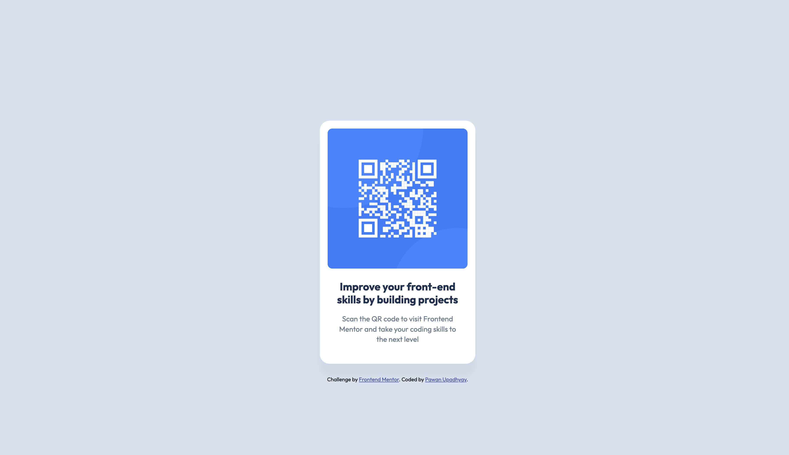

# Frontend Mentor - QR code component solution

This is a solution to the [QR code component challenge on Frontend Mentor](https://www.frontendmentor.io/challenges/qr-code-component-iux_sIO_H).  

## Table of contents

- [Overview](#overview)
  - [Screenshot](#screenshot)
  - [Links](#links)
- [My process](#my-process)
  - [Built with](#built-with)
  - [What I learned](#what-i-learned)
  - [Continued development](#continued-development)
  - [Useful resources](#useful-resources)
- [Author](#author)


## Overview

### Screenshot



### Links

- Live Site URL: [QR Component](https://fm-qr-code-component-00.netlify.app)

## My process

### Built with

- Semantic HTML5 markup
- CSS custom properties
- Flexbox


### What I learned

- I have learned the fundamentals of HTML and CSS, including how to utilize CSS custom properties to create reusable and maintainable styles and Flexbox for layout design.
- Learned how to center elements both horizontally and vertically using CSS.

```html
<h1 class="primary-heading fw-bold fs-heading line-height-120 text-color-heading">
  Improve your front-end skills by building projects
</h1>
```
```css
.card {
  --max-width: 320px;
  padding: var(--ps-200) var(--ps-200) var(--ps-500);
  width: min(var(--max-width), 100%);
  margin-inline: auto;
  border-radius: var(--border-radius-medium);
  overflow: hidden;
}
```

### Continued development

- I want to improve my knowledge of CSS, like flexbox, grid, responsive layouts, etc.
- Improve my HTML knowledge for better semantic HTML, accessibility. Learning features like forms, multimedia, and input types.


### Useful resources

- [MDN HTML](https://developer.mozilla.org/en-US/docs/Web/HTML) - This helped me with my HTML. It was easy to read and understand.
- [MDN CSS](https://developer.mozilla.org/en-US/docs/Web/CSS) - This helped me with my CSS.


## Author

- Frontend Mentor - [@pawanU02](https://www.frontendmentor.io/profile/pawanU02)
